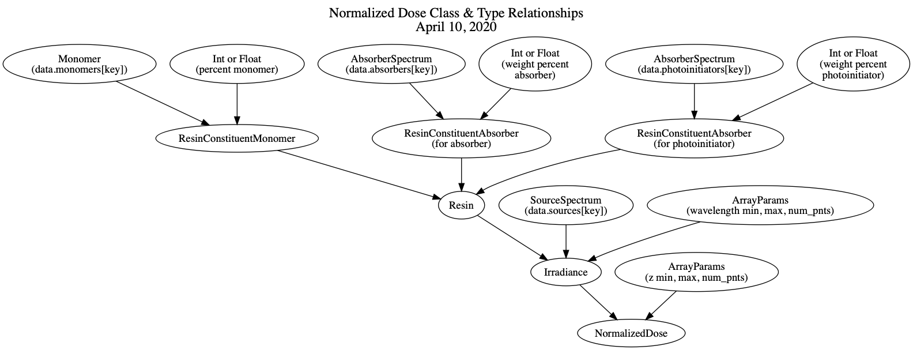

# Next

- &#9989; Create module process_absorber_spectrum.py
- &#9989; Add tests for process_absorber_spectrum.py
- &#9989; Change process_absorber_spectrum.py so that it handles FIRE files and older csv files
- &#9989; Add 2017 avobenzone measurements using a pull request
- &#9989; Create an AbsorberSpectrum class similar to the SourceSpectrum class
    - &#9989; Read absorbance as well as molar absorptivity
    - Put in error checks for presence of 2 data files
    - Read json string in first line of data files
    - Use json string for various labels, etc.
- &#9989; Compare 2020 and 2017 avobenzone molar absorptivity
- &#9989; Move absorbers and sources to data/__init__.py from data/absorbers/__init__.py and data/sources/__init__.py
- &#9989; Add & process spectrum data for more 2017 absorber measurements
- &#10060; Create a PhotoinitiatorSpectrum class?
- &#9989; Need to be able to override `force_zero` for Sudan I absorber
- &#9989; Re-do Sudan I absorber
- In process_absorber_spectrum.py read spectrum_config.json, display values, allow to override values
- &#9989; Add 2020 Irgacure 819 absorption measurements
- &#9989; Add 2017 Irgacure 819 absorption measurements and compare to 2020
- &#10060; Add other photoinitiators
- &#9989; Add other sources
- &#9989; Create interpolation function for spectra
- &#9989; Create a Resin class that includes one or more photoinitiators and absorbers
    - Since they are all absorbers, can probably put them all into a list
    - Calculates molar concentrations that can be used in absorption coefficient calculation
    - Calculates absorption coefficient, alpha(lambda)
        - Make this so can linearly interpolate values for arbitrary wavelengths
- &#9989; Move Resin class to resin.py
- &#9989; Create tests for Resin class
- &#9989; Need to modify Resin class to give a resin a name
- &#9989; Create a ResinSourceCombo class
    - &#9989; Calculate D_n(lambda)
    - &#9989; Fit to Models 1 and 2
- &#9989; Create an Irradiance class to calculate irradiance as a function of wavelength and z
- &#9989; Create test that uses ideal source, absorber, density
- Also use these for integrations checks over the source, and for D_n(z)
- Use to plot normalized dose as a function of lambda and z
- Validate D_n(z) - compare with what I got in January 2019?
- Create graphviz diagram of class relationships
- Create data and classes to handle thickness vs exposure time measurements and Model 3 & 4 fits
- Create documentation to explain theory and how code works
- Create a class like SourceSpectrum, except it lets you manipulate source with actual or ideal spectral filter

# Friday, 4/10/20

## Log

- Create GraphViz diagram of relationships between classes

# Saturday, 4/4/20

## Log

- Update README files to add instruction for how to add 3 letter abbreviation when add a new absorber, photoinitiator, or monomer
- Add info about ideal uniform source and absorber
- Add test for ideal uniform source and absorber and resin name without absorber or without photoinitiator
- Create class `NormalizedDose` and begin development in notebook

# Friday, 4/3/20

## Log

- Create ideal uniform source 10 nm wide, 360-370 nm
- Create ideal uniform absorber, 320-390 nm
- Create ideal monomer, density = 1000 g/L

# Tuesday, 3/31/20

## Next

- &#9989; Make png graphs of filtered/unfiltered spectrum vs z?
- &#9989; Move Irradiance and ArrayParams to python files
- &#9989; Write tests for both
- &#10060; Add integrated power at z=0 to Irradiance - no, it should go elsewhere
- &#10060; Add integrated power for all z's? - no, it should be done elsewhere
- &#10060; Create a test source, absorber, monomer with analytically calculated parameters so can use for comparisons and tests

## Log

- Start to develop `Irradiance` class in notebook
- Use `Irradiance` class to examine effect of short pass filter on spectrum as function of z
- Evaluate propagation in 0.38% avobenzone resin for 4 LED cases using Irradiance class
- Add tests for `ArrayParams` and other functions in utilities.py
- Create `irradiance.py` and add tests
- Try matplotlib 3D plots

# Saturday, 3/28/20

## Plan

- Analytical method to test normalized dose
- Swiss army knife normalized dose function or class
- Compare 1-to-1 with 2017 normalized dose calculation

# Friday, 3/27/20

## Log

- Add name attribute to `AbsorberSpectrum`
- Implement new resin name method
- Create tests for new resin name method
- Start to develop ResinSpectrumCombo class in notebook
- Create a `ResinSourceCombo` class and calculate D_n(z)

## Name algorithm

Central problem: given ?, get 3 letter abbreviation  
Subsidiary problem: given concentration, format for number?

What are the sources of information we can use to get the name of a material?

- Absorber/Photoinitiator
    - ResinConstituentAbsorber.material (AbsorberSpectrum) -> name
- Monomer
    - ResinConstituentMonomer.material (Monomer) -> name

Where can we get the concentration of a material?

- Absorber/Photoinitiator
    - ResinConstituentAbsorber.material (AbsorberSpectrum) -> concentration_ww_percent
- Monomer
    - ResinConstituentMonomer.material (Monomer) -> concentration_percent_monomer

# Thursday, 3/26/20

## New way to organize package:

- resinanalysis
    - spectra
        - Absorption & emission spectra, Models 1 & 2, D_n(z)
    - resinmeas
        - measurements of polymerized thickness as a function of dose, Models 3 & 4

We need a method of naming a resin, and naming a resin-spectrum combination. See https://nanomicro.byu.edu:31415/Nordin/5e7d20127e21f986afbc652a/page.

## Log

- Add left=0.0, right=0.0 to np.interp arguments
- Add name attribute to SourceSpectrum
- Come up with a resin naming convention with my students
- Develop code in `spectra.data.__init__.py` for generating name abberviation and material type

# Wednesday, 3/25/20

- Add source spectra for:
    - HR2 385 nm
    - HR3.3 365 nm with and without 370 nm short pass filter, both with and without tray
- Move `Resin` and related classes from notebook to `resin.py`
- Add source spectra for:
    - MR1 385 nm
    - MR1 365 nm no filter
    - MR1 365 nm with filter
- Create tests for `Resin` class

# Tuesday, 3/24/20

- Make `ResinConstituentAbsorber` and `ResinConstituentMonomer` classes
- Add docstrings and examples to `ResinConstituent...` classes
- Create docstring for `Resin` class prior to writing code
- Add `molar_mass_g_per_mole` to `AbsorberSpectrum` by reading json 1st line in `molar_absorptivity.csv`, update tests
- Create code for `Resin` class and try it out, still needs tested
- Try out the cases for Resin class when there are no absorbers or no photoinitiators or none of both

# Monday, 3/23/20

- Add a Monomers class, create data.monomers
- Add tests for Monomers class and debug
- Start to develop a Resin class, starting with constituent materials

# Saturday, 3/21/20

- Modify `process_absorber_spectrum.py` GUI with checkbox for `force_zero` to handle Sudan I case
- Add 2020-01-20 Irgacure 819 absorption spectrum measurement 
    - it has a different magnitude than the 2017-04-13 measurement
    - **Do we need to measure the transmission spectrum multiple times for PEGDA and PEGDA+Absorber and do averages for each??? Or calculate absorbance for each and average absorbances??**
    - **Move the sandwiched sample slides between each measurement so sample different physical locations on the slide sandwich??**
    - It all comes down to what is the source for the measurement variations:
        - Position-dependent resin thickness between the 2 slides?
        - Inaccurate resin thickness measurement
            - Systematic error measuring thickness of white films
            - Bowing of glass slides when ends are clamped, which can lead to difference in thickness from white film thickness, and position-dependent thickness
    - Measure multiple resin samples in the same slide sandwich?
- Provide clear instructions to add a spectrum in `data/absorbers/README.md` and `data/photoinitiators/README.md`
- Add more sources: Asiga 405 nm, HR1 385 nm, MR1 Wintech 365 nm with and without 370 nm short pass filter
- Add interpolation methods to SourceSpectrum and AbsorberSpectrum
- Add test for SourceSpectrum
- Add test for AbsorberSpectrum

# Friday, 3/20/20

- Find that when using `%matplotlib widget` I need to save figure files as `.svg`.
- Move absorbers and sources to data/__init__.py from data/absorbers/__init__.py and data/sources/__init__.py
- DRY refactor of data/__init__.py
- Change flag to zero absorbance in long wavelength, no absorption region
- Add absorbance data to AbsorberSpectrum
- Add a bunch of absorbers from 2017

# Thursday, 3/19/20

- Write tests for `process_spectrum_data` in `process_absorber_spectrum.py`

Current spectrometer data file format is different from several years ago:

- Current
    - `.txt`
    - 14 header lines with no particular starting character
    - ` ` separator between values
- Previous
    - `.csv `
    - 2 header lines starting with `#`
    - `,` separator between values

Modify spectra.utilities.read_spectrometer_file to read both spectrometer file types 

- Process 2017-04-13 avobenzone data
- Create an AbsorberSpectrum class
- Compare 2020 and 2017 avobenzone molar absorptivity

# Wednesday, 3/18/20

## Code to process absorber spectrum

- `process_absorber_spectrum.py` and preceeding notebooks
- Start to develop tests

## pytest

### Install

    $ pip install pytest
    $ pip install pytest-cov
    $ pip freeze > requirement.txt

### Use

Pytest command to get code coverage, verbose, and allow code to print to terminal:

    $ pytest --cov spectra --cov-report term-missing -vv -s

