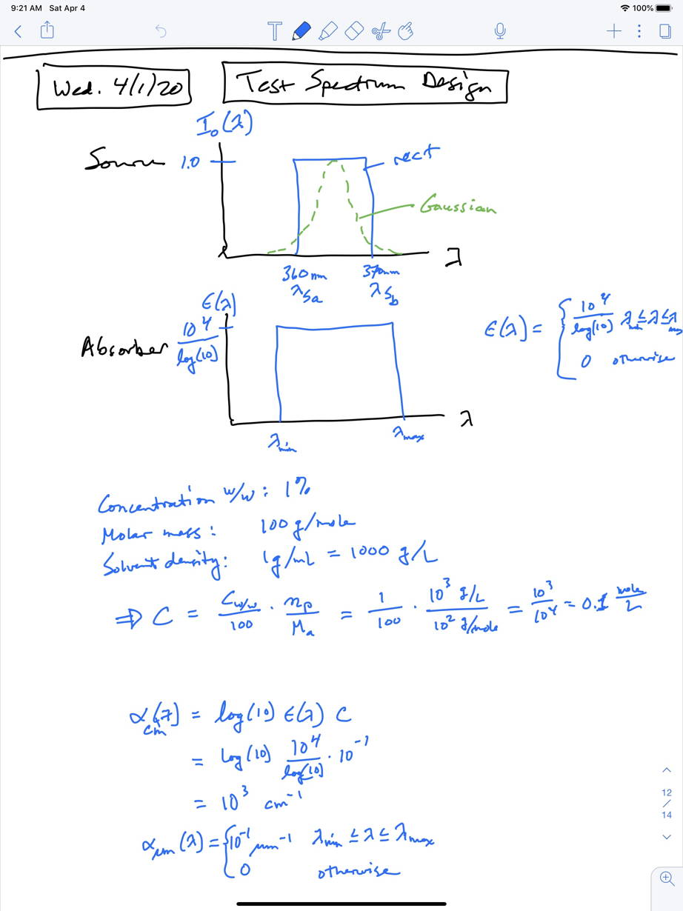

# Contents

This directory contains data for absorbers, photoinitiators, and sources organized in the following directories.

    data
    ├── README.md
    ├── __init__.py
    ├── absorbers
    ├── photoinitiators
    └── sources

The `absorbers` and `photoinitiators` directories contain absorption spectrum data for various materials measured with an Ocean Optics QE65PRO-ABS spectrometer with 100 &mu;m core diameter fiber and 10 &mu;m slit, 199-1001 nm range, 1.6 nm resolution, and purchased October 2012. See [`absorbers/README.md`](absorbers/README.md) and [`photoinitiators/README.md`](photoinitiators/README.md) for more details.

The `sources` directories contain emission spectrum data for various 3D printers and LEDs. Measurements are made with an [Ocean Optics Flame Spectrometer FLMS15581](https://www.oceaninsight.com/products/spectrometers/) with 300-440 nm range, 0.23 nm resolution, and purchased August 2019. Spectrum measurements before this date were made with the QE65PRO-ABS. See [`sources/README.md`](sources/README.md) for more details.

This material absorption data and source emission data can be used to calculate $h_a$ for Model 1 and $a$ and $b$ for Model 2 in [Custom 3D printer and resin for 18 μm × 20 μm microfluidic flow channels](https://www.ncbi.nlm.nih.gov/pubmed/28726927).

# Loading your own data

You can load spectrum data from any directory on your filesystem — useful in notebooks and scripts without modifying the package. Loaded entries are added to the in-memory dicts for the current session only.

```python
import resin_spectral_analysis.data as data

# Absorber or photoinitiator: directory must contain absorbance.csv and molar_absorptivity.csv
data.load_absorber("/path/to/my_absorber_dir")
data.load_absorber("/path/to/my_absorber_dir", name="my_key")   # explicit registry key
data.load_photoinitiator("/path/to/my_pi_dir")

# Source: directory must contain measured_spectrum_normalized.csv
data.load_source("/path/to/my_source_dir")

# Monomer: path to a JSON file with "Name", "Long name", and "Density g/L" fields
data.load_monomer("/path/to/my_monomer.json")

# Loaded entries appear in the same dicts as bundled data
print(data.absorbers.keys())
print(data.sources.keys())
```

See the README.md in each sub-directory for the required file formats. If you have raw spectrometer measurement files rather than pre-processed CSV files, run `process-absorber-spectrum` first to produce `absorbance.csv` and `molar_absorptivity.csv` — see [`absorbers/README.md`](absorbers/README.md) for the full workflow.

# Adding new spectrum data

See the README.md file in each sub-directory (sources, absorbers, photoinitiators) for directions on how to add new spectrum data to the package.

# Ideal uniform source and absorber for tests

An ideal uniform source and absorber are included, as well as an ideal monomer, to facilitate testing code. They can also be used in exploratory calculations. Notes on the source and absorber are included below.

